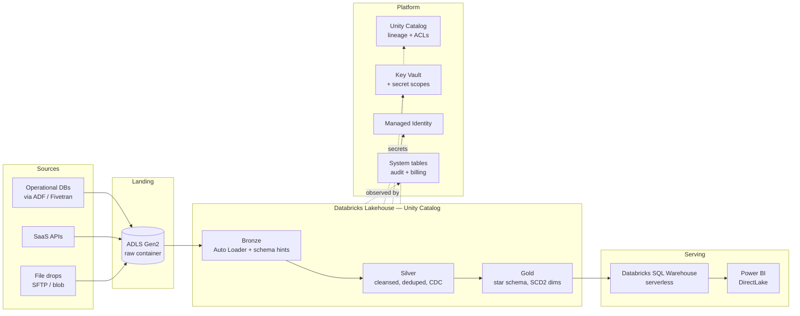

# Architecture

A production-grade Azure Databricks medallion lakehouse. This document explains the design, the tradeoffs, and what was changed from the common "Synapse + DLT" reference architecture that inspired it.

## High-level diagram

## What's different from the reference diagram

The source diagram (Databricks + ADF → Data Lake Gen2 bronze/silver/gold → Synapse + Power BI) is a common 2022-era pattern. It works but leaves gaps that this design closes.

| Concern | Source diagram | This design | Why |
|---|---|---|---|
| Governance | Filesystem paths, no catalog | **Unity Catalog** (three-level namespace, lineage, row/column filters) | Path-based ACLs don't scale; UC gives column-level masking, automatic lineage, and cross-workspace sharing |
| Serving | Azure Synapse (dedicated SQL pool) | **Databricks SQL Warehouse** serving Power BI via **DirectLake** | Synapse dedicated duplicates data and charges for idle DWUs; DirectLake reads Delta directly, no copy, no refresh |
| Data quality | Implicit | **DLT `expect` / `expect_or_drop` / `expect_or_fail`** on every silver+gold table | Failed rows are quarantined, not silently dropped; event log surfaces DQ metrics per run |
| CDC / SCD | Hand-rolled merges | **`APPLY CHANGES INTO`** (SCD1) and **`APPLY CHANGES INTO ... STORED AS SCD TYPE 2`** (history) | DLT handles tombstones, out-of-order events, and schema evolution |
| Orchestration | Mixed ADF + notebooks | **Databricks Workflows + Asset Bundles** (code-defined, Git-tracked) | dbx is deprecated; Bundles are the supported path, with env-aware deploys |
| CI/CD | Usually manual | **GitHub Actions** → bundle validate → unit tests → deploy to dev/staging/prod | Every PR gets a plan; main deploys to dev; tags deploy to prod |
| Secrets | Sometimes in notebooks | **Key Vault + Databricks secret scopes** (AKV-backed); no secrets in code | Service principals rotate; notebooks never see a raw secret |
| Identity | Storage account keys | **Managed Identity** + **Unity Catalog storage credentials** | Keys leak; MI does not |
| Network | Public endpoints | **Private endpoints** on storage + Key Vault; VNet-injected workspace | Data never traverses public internet |
| Observability | Ad-hoc | **System tables** (`system.access.audit`, `system.billing.usage`, `system.lakeflow.*`) + **pipeline event log** | One SQL query for "who queried PII this week" and "which pipeline burned DBUs" |
| File format | Delta | Delta + **Liquid Clustering** on gold facts | No more `OPTIMIZE ZORDER BY` decisions; clustering is automatic |
| Testing | Usually none | **pytest** for pure functions + **DLT integration tests** using fixture data | DQ rules are asserted before deploy, not discovered in prod |

## Layer contracts

### Bronze — `catalog.bronze.<source>_<table>`
- **Writer**: Auto Loader (`cloudFiles`), schema inference + evolution with hints.
- **Contract**: append-only, lossless copy of source. One row per source event. Includes `_source_file`, `_ingest_ts`, raw payload.
- **Retention**: 90 days (configurable).

### Silver — `catalog.silver.<entity>`
- **Writer**: `APPLY CHANGES INTO` (SCD1) keyed on business key.
- **Contract**: one row per active business entity, type-cast, deduped, rejected rows quarantined via `expect_or_drop`.
- **Expectations**: not-null on keys, referential sanity (e.g. `order_date <= ingest_ts`), domain enums.

### Gold — `catalog.gold.{dim_*, fct_*}`
- **Writer**: materialized views for dims, streaming tables for facts.
- **Shape**: Kimball star schema. Dims use surrogate keys (`<entity>_sk`), SCD2 where history matters (`dim_customer`). Facts use additive measures only; semi-additive lives in the semantic model.
- **Consumers**: Power BI DirectLake, ad-hoc SQL, downstream ML feature tables.

## Environments

Three Databricks workspaces (dev / staging / prod) sharing one Unity Catalog metastore per region. Each has its own catalog (`dev_sales`, `stg_sales`, `prod_sales`). Asset Bundle targets select the right workspace + catalog.

Promotion: PR → dev (auto on merge) → staging (manual) → prod (tag `v*`).

## Security

- **Authn**: Service Principal with federated credentials from GitHub Actions (no long-lived secrets in CI).
- **Authz**: Unity Catalog grants at catalog/schema/table level. Row filters and column masks defined as SQL functions, applied via `ALTER TABLE ... SET ROW FILTER`.
- **Data at rest**: CMK (customer-managed keys) in Key Vault for ADLS and workspace managed disks.
- **PII**: tagged via UC tags (`pii=true`), masked for the `analyst` role, readable by the `pii_reader` role.

## Cost controls

- SQL Warehouse: serverless, auto-stop 10 min, scale 1–4 clusters.
- DLT: continuous for hot pipelines, triggered for cold. Photon on.
- Storage: lifecycle rules archive bronze >90d to cool tier.
- Budget alerts on `system.billing.usage` via Azure Monitor.

## What's deliberately not here

- **No Synapse**. Databricks SQL + Power BI DirectLake covers every serving case Synapse did, without the copy.
- **No ADF for transformation**. ADF is fine for raw ingestion from legacy sources, but transformation lives in DLT where lineage and DQ are first-class.
- **No feature store yet**. Add `databricks-feature-engineering` when the first ML use case lands; premature otherwise.
- **No streaming to bronze from Event Hubs**. Add a separate streaming DLT when the first real-time source appears. Current sources are batch.
